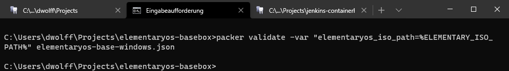
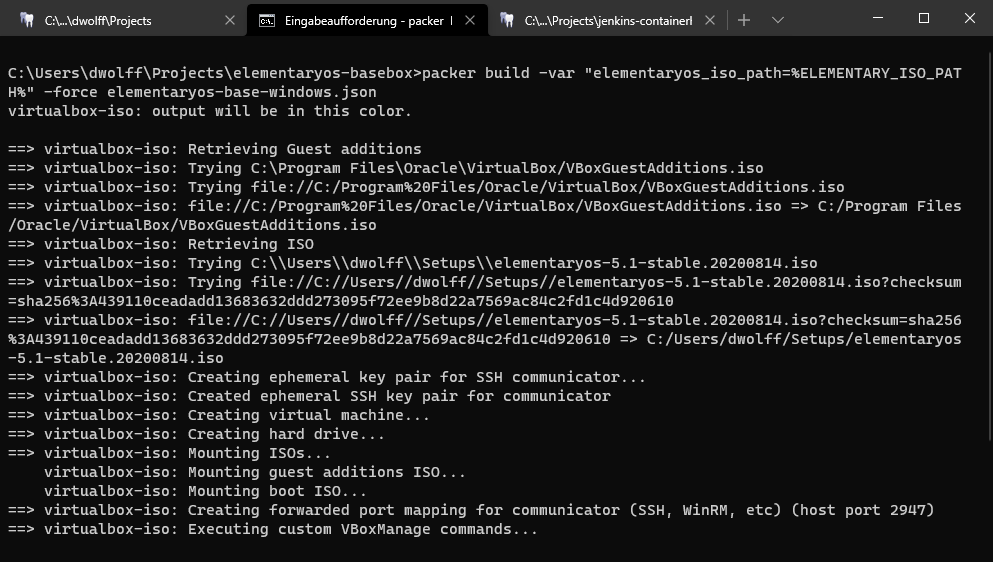

<!-- omit in toc -->
# Elementary Base Box

Goal of this project is to create an elementary os base box for vagrant with [packer](https://www.packer.io).
The creation of the box fails in 60% of the builds which looks like timing issues because it succeeds in the other 40% without changing anything.

Because of missing resources the development is currently only done for the windows packer file `elementaryos-base-windows.json`

> :warning: The ElementaryOS installer needs a graphical user interface and because of this the creation of the basebox can't be run on headless systems

<!-- omit in toc -->
## Table of Contents

- [Build the basebox](#build-the-basebox)
- [Test the basebox](#test-the-basebox)
- [Explanations](#explanations)
  - [SSH Configuration](#ssh-configuration)
  - [Guest Additions](#guest-additions)

## Build the basebox

We start by creating the image for virtualbox. We do this because it is easier to test the created image that way. Once we decide that the image is good we will create a base box instead of a virtualbox image.

VirtualBox images can be created from several sources:

- An .iso file
- An OVF/OVA file
- An available virtual box vm

However as we do not have an already available ElementaryOS VM or an ovf/ova file we will use an iso image to create the basebox.

1. Open the file `elementaryos-base-windows.json` in your prefered editor
1. Locate the entry `iso_checksum` and provide the checksum for the downloaded iso file. It can be found in the elementary docs at the install section: <https://elementary.io/en/docs/installation#verify-your-download>
1. Open a terminal and navigate to the folder with the `elementaryos-base-windows.json` file
1. Create an environment variable for the path to your elementaryos iso file: `set "ELEMENTARY_ISO_PATH=C:\\Users\\dwolff\\Setups\\elementaryos-5.1-stable.20200814.iso"`
1. Make sure the packer file is valid: `packer validate -var "elementaryos_iso_path=%ELEMENTARY_ISO_PATH%" elementaryos-base-windows.json` and hit enter  

1. Build the ElementaryOS basebox: `packer build -var "elementaryos_iso_path=%ELEMENTARY_ISO_PATH%" -force elementaryos-base-windows.json`  

1. Packer will now start the vm and install the os  


<!--
Because of a bug in the Virtualbox Guest Additions we need to allow exit code 1
https://stackoverflow.com/questions/25434139/vboxlinuxadditions-run-never-exits-with-0
-->

## Test the basebox

1. Remove a maybe already existing basebox: `vagrant box remove ElementaryOS`
1. Add the created box to vagrant with: `vagrant box add ElementaryOS .\ElementaryOS.box`  

1. Create a new vagrant project with the ElementaryOS box as base: `vagrant init -m ElementaryOS`
1. Open the vagrantfile
1. Add the following:

    ```ruby
    config.vm.provider "virtualbox" do |vb|
        # Display the VirtualBox GUI when booting the machine
        vb.gui = true
    end
    ```

1. Start the machine: `vagrant up`
1. You should have a running ElementaryOS

1. With vagrant ssh access enabled


References:

- <https://stackoverflow.com/questions/22065698/how-to-add-a-downloaded-box-file-to-vagrant>

## Explanations

### SSH Configuration

As stated by the packer documentation the initial ssh setup needs to be done by the boot command.

> If you are building from a brand-new and unconfigured operating system image, you will almost always have to perform some extra work to configure SSH on the guest machine. For most operating system distributions, this work will be performed by a boot command that references a file which provides answers to the normally-interactive questions you get asked when installing an operating system.

Unluckily for us ElementaryOS doesn't support a preseed file. Because of this we need to wait until the installation has been done and then we simulate the keys that are needed to login, open a terminal and install the ssh server. This is done the following way:

1. Install the openssh-server and wget which is needed to download the current vagrant key: `sudo apt install wget openssh-server -y`
1. Create the ssh directory for the vagrant user: `mkdir ~/.ssh`
1. Set the correct access rights for the ssh directory: `sudo chmod 700 ~/.ssh`
1. Chante to the ssh directory: `cd ~/.ssh`
1. Add the current vagrant key to the authorized_keys: `wget --no-check-certificate 'https://raw.github.com/mitchellh/vagrant/master/keys/vagrant.pub' -O authorized_keys`
1. Add the public key of the ephemeral ssh keypair that packer created automatically: `echo {{.SSHPublicKey}} >> ~/.ssh/authorized_keys`
1. Set the correct access rights for the authorized_keys file: `sudo chmod 600 ~/.ssh/authorized_keys`
1. Make sure that the ssh file belongs to the vagrant user: `chown -R vagrant ~/.ssh`
1. Restart the ssh daemon to activate the changes: `sudo systemctl restart sshd`

You can see that all these steps are done in the boot_command:

```vagrant
"<wait15s>sudo apt install wget openssh-server -y<enter>",
"<wait2m>mkdir ~/.ssh<enter>",
"<wait2s>sudo chmod 700 ~/.ssh<enter>",
"<wait2s>cd ~/.ssh<enter>",
"<wait2s>wget --no-check-certificate 'https://raw.github.com/mitchellh/vagrant/master/keys/vagrant.pub' -O authorized_keys<enter>",
"<wait3s>echo {{.SSHPublicKey}} >> ~/.ssh/authorized_keys<enter>",
"<wait3s>sudo chmod 600 ~/.ssh/authorized_keys<enter>",
"<wait3s>chown -R vagrant ~/.ssh<enter>",
"<wait3s>sudo systemctl restart sshd<enter><wait3s>"
```

References:

- <https://www.packer.io/docs/communicators/ssh>
- <https://www.packer.io/guides/automatic-operating-system-installs>
- <https://github.com/hashicorp/vagrant/tree/master/keys>
- <https://superuser.com/questions/287651/can-i-have-multiple-ssh-keys-in-my-ssh-folder>

### Guest Additions

Install necessary libraries for guest additions and Vagrant NFS Share: `sudo apt-get -y -q install linux-headers-$(uname -r) build-essential dkms nfs-common`

References:

- <https://www.packer.io/docs/provisioners/shell>
- <https://www.vagrantup.com/docs/providers/virtualbox/boxes>
